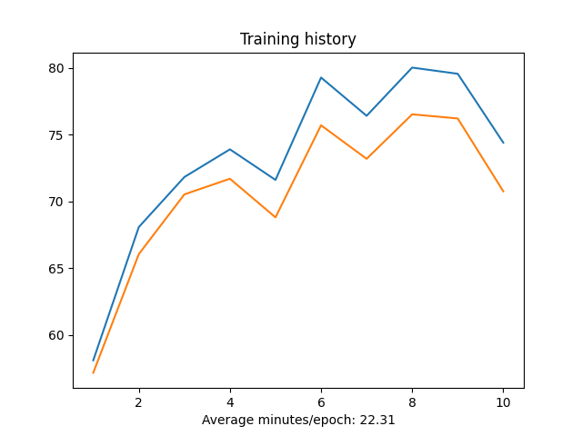

# CIFAR10-model
A convolutional neural network which classifies objects from the CIFAR-10 dataset with 76.51% accuracy. The project was restricted by the computational capabilities available. Written with PyTorch

About the model:
The architecture of the model reuses predefined convolutional blocks and fully-connected blocks. 
The architecture follows the general rule of increasing the number of filters by two while decreasing the size of the input image by the same amount. Both the size of the image and the number of filters can be expressed through the powers of two, which leads to better performance. You can observe the implementation in net.py , and download the models from the models folder.

Confusion matrix and accuracy:

Training history plot:

csv log:
https://github.com/vvvvvaves/CIFAR10-model/blob/main/WMA4_py/models/log.csv

model:
https://github.com/vvvvvaves/CIFAR10-model/blob/main/WMA4_py/net.py

