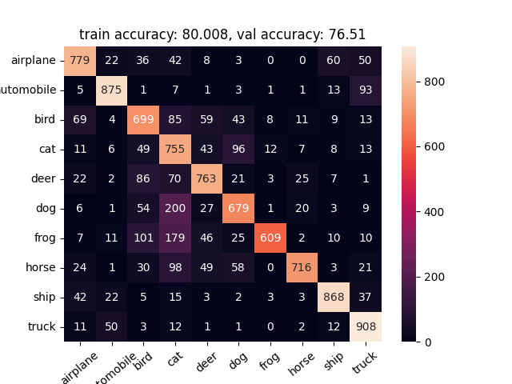

# CIFAR10-model
A convolutional nueral network which classifies objects from the CIFAR-10 dataset with 76.51% accuracy. The project was restricted by the computational capabilities available. Written with PyTorch

Confusion matrix:

https://github.com/vvvvvaves/CIFAR10-model/blob/main/WMA4_py/confm_accuracy.png
